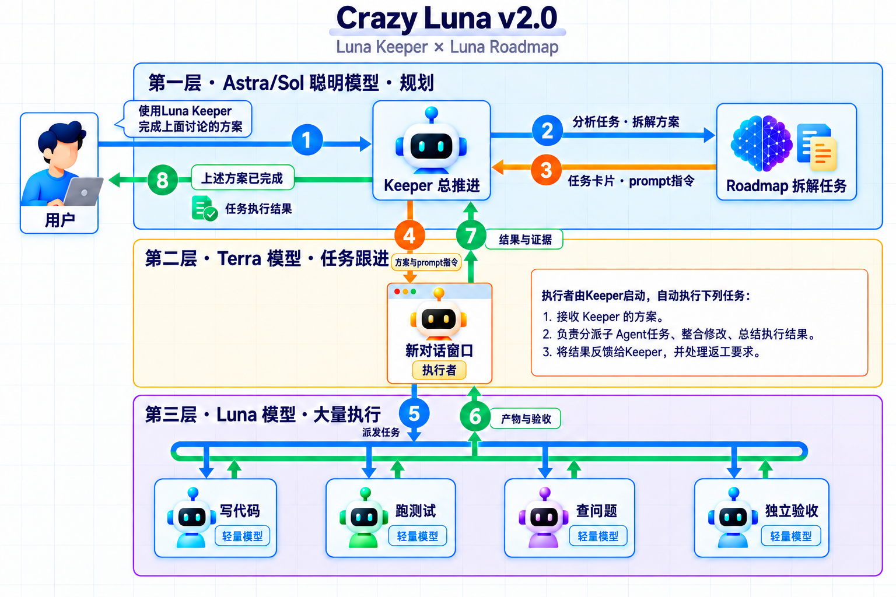

# Crazy Luna

- 当前版本：v2.0.1
- 最新更新日期：2026-09-21

## 简介


### 使用方法

当讨论完成方案的时候，只需要这样告诉Codex：

```text
使用 $luna-keeper 执行上面的任务，在未完成之前遇到的问题尽量自己想办法解决。
```

### 组成与原理

Crazy Luna 由两个 Skill 配合：

- [Luna Keeper](skills/luna-keeper/SKILL.md)：负责把开发目标持续推进到完成，组织规划、执行和验收，未完成就继续跟进。
- [Luna Roadmap](skills/luna-roadmap/SKILL.md)：负责读取项目现状，把需求整理成可执行方案和验收标准。

其中
- **Keeper 是司令，负责一场大战役“做到完成”；**
- **Roadmap 是参谋，负责制定“路线图”、解决“怎么做”；**
- **执行者对话窗口是旅长，由司令派生，负责按照指令组织连队(Subagent)完成每一场战争**




## 安装

将下面的内容复制到 Codex 输入框中：

```text
请帮我安装 Luna Roadmap 和 Luna Keeper。
仓库地址：https://github.com/KakaTelnet/CrazyLuna.git

请按当前工具的 Skill 安装规则，将仓库中的以下两个完整目录
安装到对应的 Skill 管理位置：
- skills/luna-roadmap
- skills/luna-keeper

保留目录内的全部文件和子目录。
安装完成后，检查这两个 Skill 是否可以被当前工具识别，并告知我如何调用。
```

## Luna Keeper Skill 介绍

在 Codex 中打开目标项目，讨论并确认需求后，在同一个对话中输入：

```text
使用 $luna-keeper 执行任务，完成上述目标。
```

已有方案或执行任务会优先复用。需要明确新建任务、模型和交付范围时，可以使用完整指令：

```text
使用 $luna-keeper 执行任务，完成上述目标。
请新建一个执行任务，协调者使用 gpt-5.6-terra，
实施和独立验收子 Agent 使用 gpt-5.6-luna，推理档位均为 medium。
持续跟进执行和验收，直到完成目标。
本次交付可供我审阅的代码改动和验证结果。
```

执行期间仍在这个对话中沟通，例如：

```text
- “这一轮完成并验收后先给我看，暂时不要进入下一轮。”
- “最多同时安排 2 个子 Agent。”
- “先停一下，保留当前成果，告诉我哪些工作还在进行。”
- “继续刚才的任务，按已确认的目标推进。”
```

暂停时会核实正在执行的工作是否已经停下。反复尝试没有进展、达到指定限制或需要补充权限时，会报告阻塞原因。

交付结果包含实际工作区、改动、独立验收证据和未完成项。需要合入指定分支或集成回原项目时，在启动时说明目标位置和验证要求。

## Luna Roadmap Skill 介绍

只需要方案时，在确认需求的对话中输入：

```text
使用 $luna-roadmap 为上述目标制定实施方案并保存，给出启动 Prompt。
```

生成方案和 Prompt 不会启动执行。看过方案后，在执行对话中选择方案指定的模型，再粘贴启动 Prompt；也可以交给 Keeper 接续。

仅讨论时说明“先在对话中给我看方案”。讨论和预览不写文件，需要保存时再提出。

## 配置与限制

- 规划沿用当前对话的模型。新执行任务和子 Agent 的默认模型见 [模型配置](skills/luna-roadmap/references/models.md)，已有执行任务保留原设置。实际可用的模型、推理档位和并发数取决于当前工具。
- Keeper 需要 Codex 提供创建或续接任务、读取结果、等待执行和发送后续指令的能力。缺少必要能力时，会说明手动交接步骤。
- 默认在当前对话的处理过程中等待和接续。后台或稍后跟进需要明确提出，并依赖运行环境；Skill 本身不提供常驻后台运行。
- Roadmap 可按其他工具的 Skill 规则安装。工具无法派发子 Agent 时，使用生成的手动会话 Prompt。
