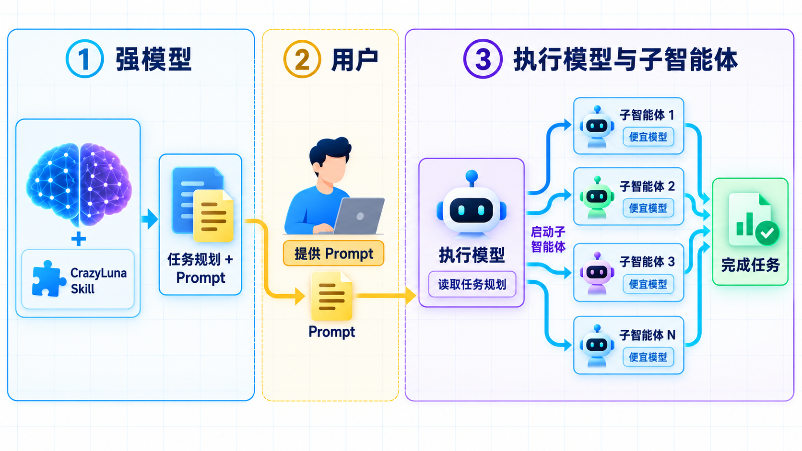

# Crazy Luna

- 当前版本：v1.1.1
- 最新更新日期：2026-09-10

## SKILL介绍

> - Crazh Luna Skill使用强模型规划任务，
> - 生成Prompt用来启动调度多个子Agent
> - 使用便宜模型依照规划处理大量细节任务。

- CrazyLuna 是一个供强模型使用的 Skill，用来规划任务，并生成一段交给用户的启动 Prompt。
- 用户将这段 Prompt 交给智能体工具，即可让工具按方案调度多个子 Agent，并指定子 Agent 使用便宜模型。
- 通过调度智能体和大量的便宜的子智能体协作，完成大量具体、细碎的执行工作。




- 你只需要向强模型说明要做什么，CrazyLuna 会引导它给出执行方案和使用prompt。
- 再将CrazyLuna提供的prompt复制到新建窗口中粘贴执行
- 就可以等待执行智能体按照强模型的规划，调度大量子智能体完成你的任务。

## CrazyLuna 使用场景

- **“想让强模型把方案做好，再让便宜模型干细节活。”** 用 CrazyLuna 生成实施方案和启动 Prompt，再把 Prompt 交给智能体工具，调度使用指定便宜模型的子 Agent 执行。
- **“直接让便宜模型改代码，总要来回解释。”** 先查清现有实现，把修改位置、处理规则和完成标准写进方案，减少执行时的猜测和反复沟通。
- **“任务细节太多，想让几个子 Agent 分头做。”** 由强模型先拆分任务、明确每个子 Agent 的指令和文件范围，再通过启动 Prompt 让工具按依赖安排并行或串行执行。
- **“想省模型开销，但完成后还得有人检查。”** 在安排执行时一并安排独立验收，要求核对实际改动和测试结果，有问题就返工，并留下验证证据。

默认调用会生成交接方案和启动 Prompt。用户提交启动 Prompt 或明确要求执行后，再开始实施。

## CrazyLuna 安装方式

将以下内容复制并在 Codex/workbuddy 输入框中执行：

```text
请帮我安装 CrazyLuna Skill。
项目 Git 地址：https://github.com/KakaTelnet/CrazyLuna.git

请获取该仓库，并根据当前工具的 Skill 安装规则，将仓库中的
skills/crazy-luna 整个目录安装到对应的 Skill 管理位置，
保留目录内的全部文件和子目录。
安装完成后，请检查 Skill 是否可被当前工具识别，并告知我如何调用。
```

安装后，在工具的技能列表中选择 **CrazyLuna** 使用。

## CrazyLuna 功能介绍

### 1. 基于实际项目制定方案

读取目标项目的指令、需求、代码、测试和配置，确认当前行为与预期结果的差距。方案会区分已知事实、已确认决策、假设和待决策项，并记录源码基线与已有改动。

你得到的方案会说明修改位置、实现规则、调用或数据流变化、边界行为和可以复用的现有能力。影响产品语义、范围或授权的信息缺失时，会先请求澄清。

### 2. 按复杂度拆分任务

小任务采用简短方案，安排实现、自测和独立验收；多个独立交付物按实际依赖拆分；重复工作共用规则，按批次组织；跨阶段任务先细化已经就绪的阶段。

每项任务说明目标、输入、修改范围、负责人、执行步骤和验证方法。可以独立进行的任务允许并行，共享修改点指定唯一写入者，有前置依赖或资源冲突的任务按顺序执行。

### 3. 根据宿主能力选择模型

依据模型配置和当前工具实际提供的能力，为各角色确定模型、推理参数及选择理由。选择时考虑任务所需的工具、输入类型和上下文，再比较有依据的能力、速度与成本。

当前配置中的候选项为 `gpt-5.6-luna`、`claude-haiku` 和 `deepseek-v4.1-flash`，默认采用 `auto`，推理偏好为 `medium`。这些是候选配置，实际可用的精确型号和参数需要在宿主中核实。

没有子 Agent 派发能力时，会提供供实施和独立验收分别使用的手动会话 Prompt，并说明推进顺序。模型或参数未确认时，会列出开工前置条件。

### 4. 建立可核对的验收标准

为任务和验收标准设置稳定编号，例如 `T01`、`AC01`，串起“需求 → 任务 → 验收标准 → 证据”。每条标准说明前置条件、输入或操作、预期结果与验证方式。

方案要求由未参与产物制作的 Agent 独立验收，核对权威资料、实际差异和必要验证结果。验收证据关联到具体产物版本；后续修改影响相关结论时，需要重新验收。静态检查、测试和实际运行的结果分别记录，未执行项明确标为未验证。

### 5. 约定进度、返工与恢复流程

交接方案会要求协调者维护统一执行记录，跟踪负责人、模型、任务状态、产物版本、证据和阻塞原因：

```text
TODO → RUNNING → VERIFYING → PASS
失败进入 REWORK；缺少条件进入 BLOCKED。
```

续接时先核对方案、执行记录、实际工作区和在途 Agent，避免重复派发。局部阻塞只暂停受影响任务；整体目标缺少必要依据时，先交付事实与待决策项。只有必需验收全部满足、证据完整，才能宣布目标完成。

### 6. 交付可直接使用的启动 Prompt

默认交付包括方案文档链接、可执行范围、阻塞项、环境待查项，以及填入实际项目信息的启动 Prompt。文档遵循目标项目的文件存放规则，执行记录在执行开始时创建或续用。

启动 Prompt 会指定目标项目、权威方案、执行记录位置、首批任务和协作要求。执行者按照方案工作，无需重新调用 CrazyLuna。整体阻塞、没有独立可执行部分时，会说明解锁条件，不生成开工 Prompt。

## 如何使用 CrazyLuna

本 Skill 采用显式调用。在 Codex 中输入 `$crazy-luna`，并给出具体任务及目标项目。例如，已经打开目标项目时：

```text
$crazy-luna
为当前项目的订单列表增加按状态筛选的功能制定方案。
请先检查现有页面、接口与测试，明确修改范围和验收标准，
再给出子 Agent 分工及启动 Prompt。
```

如果需求已有文档，请同时提供文档路径或可访问引用。也可以补充本轮模型、角色或并发偏好：

```text
$crazy-luna
依据当前项目的需求文档制定实施方案。
执行角色使用 gpt-5.6-luna，推理偏好 medium，最多并行 2 个子 Agent。
```

收到方案后，查看其中的实施范围、验收标准和阻塞项，再将生成的启动 Prompt 发给执行会话；也可以在当前会话明确要求“按刚才的方案继续执行”。宿主不支持派发时，按照生成的手动会话步骤推进实施与独立验收。

## 模型配置与本地记录

长期候选模型、默认选择和推理偏好在 [模型配置](skills/crazy-luna/references/models.md) 开头的 YAML 代码块中修改。本轮在对话中指定的模型或参数优先于长期配置，且不会改写长期默认。固定默认模型必须属于候选列表；具体参数按宿主接口解析。

确认具体任务与写入授权后，Skill 会按规则在**目标项目**保存 `.crazy-luna/models.local.json`，记录宿主能力、候选模型、选择依据和核实时间，并通过 `.crazy-luna/.gitignore` 排除该本地记录。后续调用仍会复核能力。没有具体任务或整体阻塞时，不初始化记录。

## 文件与校验

维护 Skill 或需要理解交付写法时，可按需阅读[完整交付样例](ai_docs/notes/20260920-1025_完整交付样例.md)。日常调用无需读取；样例不作为固定模板或新增流程要求。

| 文件 | 用途 |
| --- | --- |
| [SKILL.md](skills/crazy-luna/SKILL.md) | Agent 使用的完整工作流程与交付要求 |
| [agents/openai.yaml](skills/crazy-luna/agents/openai.yaml) | Codex 显示名称、默认提示和显式调用策略 |
| [references/models.md](skills/crazy-luna/references/models.md) | 模型配置、宿主选择规则与本地记录格式 |
| [scripts/validate.rb](skills/crazy-luna/scripts/validate.rb) | Skill 包的静态校验脚本 |
| [scripts/test_validate.rb](skills/crazy-luna/scripts/test_validate.rb) | 16 个配置与包格式变体的维护回归检查 |

维护或修改 Skill 后，可在本项目根目录运行以下命令，需要 Ruby，脚本仅使用其标准库：

```sh
ruby skills/crazy-luna/scripts/validate.rb
ruby skills/crazy-luna/scripts/test_validate.rb
```

第一条命令检查当前包；第二条命令在内存中运行 16 个配置与包格式回归场景。两者均是维护入口。静态回归不能证明宿主加载、模型可用性或真实任务执行；这些需要另行验证。
