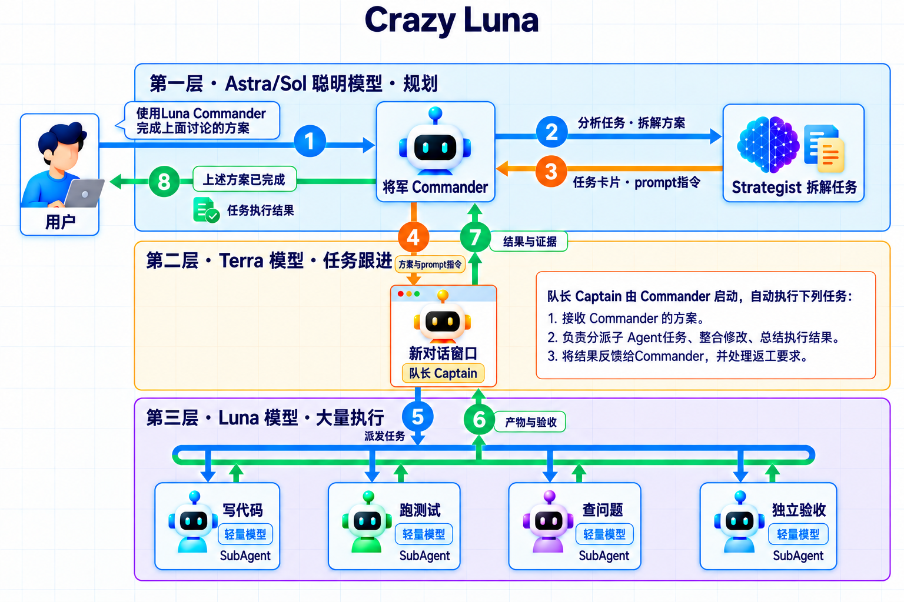

# Crazy Luna

- 当前版本：v2.2.1
- 最新更新日期：2026-09-23

## 简介


### 使用方法

当讨论完成方案的时候，只需要这样告诉Codex：

```text
使用 $luna-commander 执行上面的任务，直到解决所有问题。
```

### 组成与原理

Crazy Luna 由两个 Skill 配合：

- [Luna Commander](skills/luna-commander/SKILL.md)：**将军**，负责打赢一场大战役，使用Strategist拆解任务，执行策略和方案。创建新对话，安排Captain队长推进具体的执行和验收。并持续跟进反馈的任务。
- [Luna Strategist](skills/luna-strategist/SKILL.md)：**参谋**，制定“路线图”、解决“怎么做”的问题。为“队长”的执行和验收提供参考，防止跑偏。
- Captain：**队长**，由将军创造派生，负责创建Subagent(招募士兵)推进具体的工作。例如环境配置、代码开发、内容总结或者成果验收等。




## 安装

将下面的内容复制到 Codex 输入框中：

```text
请帮我安装 Luna Strategist 和 Luna Commander。
仓库地址：https://github.com/KakaTelnet/CrazyLuna.git

请按当前工具的 Skill 安装规则，将仓库中的以下两个完整目录
安装到对应的 Skill 管理位置：
- skills/luna-strategist
- skills/luna-commander

保留目录内的全部文件和子目录。
安装完成后，检查这两个 Skill 是否可以被当前工具识别，并告知我如何调用。
```

## 角色与模型默认配置表

本项目参考 [Artificial Analysis Intelligence Index v4.3](https://artificialanalysis.ai/articles/artificial-analysis-intelligence-index-v4-3) 的能力与成本评测，结合角色职责制定以下默认配置。具体选择规则见 [模型配置](skills/luna-strategist/references/models.md)。

| 角色 | 场景 | 模型 | 推理强度 |
| --- | --- | --- | --- |
| Commander 将军 | 整体目标管理、跨任务接续、核对交付 | 沿用当前任务模型 | 沿用当前任务档位 |
| Strategist 参谋 | 需求分析、方案设计、任务拆分、验收设计 | `gpt-6-astra` | `high` |
| Captain 队长 | 常规派发、协调、进度与证据管理 | `gpt-6-sol` | `medium` |
| Captain 队长 | 多模块依赖、集成冲突、复杂诊断协调 | `gpt-6-sol` | `high` |
| 实施／诊断 Subagent | 方案明确的普通实施、测试、常规诊断 | `gpt-6-luna` | `high` |
| 实施／诊断 Subagent | 复杂算法、状态与边界逻辑、未知根因、跨模块行为判断 | `gpt-6-sol` | `high` |
| 测试执行 Subagent | 运行既有测试、记录退出状态、采集原始证据 | `gpt-6-luna` | `high` |
| 独立验收 Subagent | 按明确标准核对需求、差异和测试结果 | `gpt-6-luna` | `high` |
| 独立验收 Subagent | 复杂验收设计、覆盖缺口、复杂边界及跨模块判断 | `gpt-6-sol` | `high` |

复杂验收中，确有独立分工价值时，可拆为 **Luna high 执行测试 → Sol high 审查证据并给出结论**；证据仍有效时无需重复运行测试。

用户明确指定优先；已有 Captain 保留原设置。任务或测试数量多本身不触发换型、升档，失败后也不会自动换成更贵的模型。

## Luna Commander Skill 介绍

在 Codex 中打开目标项目，讨论并确认需求后，在同一个对话中输入：

```text
使用 $luna-commander 执行任务，完成上述目标。
```

已有方案或执行任务会优先复用。需要明确新建任务、模型和交付范围时，可以使用完整指令：

```text
使用 $luna-commander 执行任务，完成上述目标。
规划使用 gpt-6-astra，推理档位 high。
请新建一个执行任务，协调者使用 gpt-6-sol，推理档位 medium。
普通实施及普通独立验收子 Agent 使用 gpt-6-luna，推理档位 high；
复杂实施、复杂诊断及需要复杂判断的独立验收子 Agent 使用 gpt-6-sol，推理档位 high。
持续跟进执行和验收，直到完成目标。
本次交付可供我审阅的代码改动和验证结果。
```

执行期间仍在这个对话中沟通，例如：

```text
- “这一轮完成并验收后先给我看，暂时不要进入下一轮。”
- “最多同时安排 2 个子 Agent。”
- “先停一下，保留当前成果，告诉我哪些工作还在进行。”
- “继续刚才的任务，按已确认的目标推进。”
```

暂停时会核实正在执行的工作是否已经停下。反复尝试没有进展、达到指定限制或需要补充权限时，会报告阻塞原因。

交付结果包含实际工作区、改动、独立验收证据和未完成项。需要合入指定分支或集成回原项目时，在启动时说明目标位置和验证要求。

## Luna Strategist Skill 介绍

只需要方案时，在确认需求的对话中输入：

```text
使用 $luna-strategist 为上述目标制定实施方案并保存，给出启动 Prompt。
```

Strategist 按独立角色配置选择规划模型，默认 `gpt-6-astra high`。当前任务已符合选定模型与档位时可直接规划；否则由调用方在宿主支持且派发条件满足时，交给指定模型的规划 Agent，取得并核对方案。缺少必要能力时提供手动规划交接。

生成方案和 Prompt 不会启动执行。看过方案后，在执行对话中选择方案指定的模型，再粘贴启动 Prompt；也可以交给 Commander 接续。

仅讨论时说明“先在对话中给我看方案”。讨论和预览不写文件，需要保存时再提出。

## 配置与限制

- Strategist、Captain、普通实施和独立验收分别配置模型与档位，默认值及复杂任务选择规则见 [模型配置](skills/luna-strategist/references/models.md)。用户明确指定优先，已有执行任务保留原设置。实际可用的模型、推理档位和并发数取决于当前工具；Skill 中的文字不代替实际模型派发参数。
- Commander 需要 Codex 提供创建或续接任务、读取结果、等待执行和发送后续指令的能力。缺少必要能力时，会说明手动交接步骤。
- 默认在当前对话的处理过程中等待和接续。后台或稍后跟进需要明确提出，并依赖运行环境；Skill 本身不提供常驻后台运行。
- Strategist 可按其他工具的 Skill 规则安装。工具无法派发子 Agent 时，使用生成的手动会话 Prompt。
